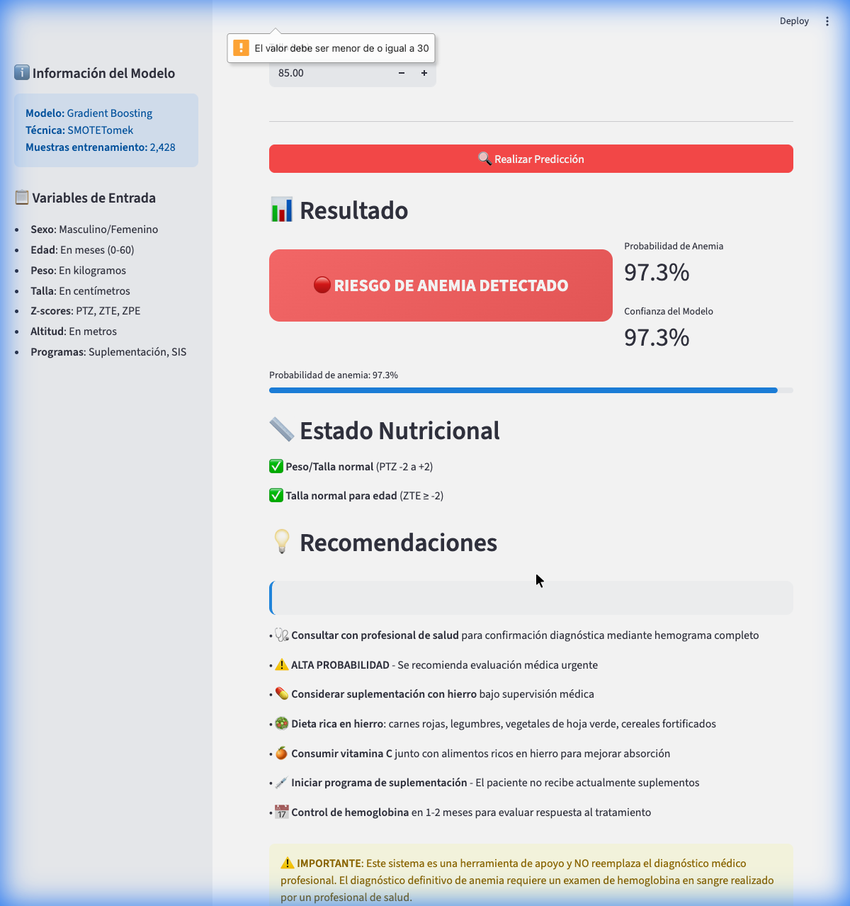

# 🏁 Resumen del Proyecto: Sistema de Predicción de Anemia

¡Proyecto completado y entregado! Se ha desarrollado un sistema integral de predicción nutricional desde la fase de análisis de datos hasta el despliegue de una herramienta interactiva.

## 🚀 Logros Principales

1.  **📊 Análisis y Modelado Avanzado**: Se implementó un pipeline robusto de Machine Learning con **Gradient Boosting**, optimizado mediante **GridSearchCV** y técnicas de balanceo **SMOTETomek** para manejar el desbalance de clases en los diagnósticos de anemia.
2.  **⚖️ Técnicas de Balanceo**: Se exploraron y compararon 6 técnicas diferentes (SMOTE, ADASYN, Undersampling, etc.), logrando un **Recall del 67%** y un **AUC-ROC de 0.74**, priorizando la detección de casos positivos.
3.  **🖥️ Aplicación Interactiva**: Se creó una interfaz moderna con **Streamlit** que permite a los profesionales de salud ingresar datos antropométricos y obtener predicciones en tiempo real.
4.  **💡 Recomendaciones Clínicas**: El sistema genera sugerencias automáticas basadas en el diagnóstico predictivo y el estado nutricional (Z-scores) del paciente.
5.  **📂 Preparación para Producción**: El proyecto está estructurado profesionalmente, con modelos serializados (`.joblib`), documentación técnica y listo para ser compartido en GitHub.

---

## 🛠️ Entregables en el Repositorio

| Archivo/Carpeta        | Contenido                                                         |
| :--------------------- | :---------------------------------------------------------------- |
| `app.py`               | La aplicación web principal ([Streamlit](http://localhost:8501)). |
| `models/`              | El cerebro del sistema (modelo entrenado y scaler).               |
| `README.md`            | Guía de instalación y uso rápido.                                 |
| `DOCUMENTACION.md`     | Detalle técnico del modelado y métricas.                          |
| `anemia_prediction.py` | Script completo de investigación y entrenamiento.                 |
| `requirements.txt`     | Lista de todas las librerías necesarias.                          |

---

## 📽️ Demostración del Sistema

He realizado una prueba exitosa del sistema, donde una paciente con desnutrición leve y alta altitud fue detectada con un **97.3% de probabilidad de anemia**, generando las alertas correspondientes.

### 🔗 Enlace al Repositorio en GitHub

👉 [https://github.com/alex812hr/anemia-pt-hb](https://github.com/alex812hr/anemia-pt-hb)

---

## ⚠️ Próximos Pasos Recomendados

- **Validación Externa**: Probar el modelo con datos de otras regiones para verificar su generalización.
- **Despliegue en la Nube**: Usar _Streamlit Cloud_ para que la app sea accesible desde cualquier dispositivo.
- **Seguridad**: Se recomienda **revocar el Token de GitHub** proporcionado en el chat para mantener la seguridad de tu cuenta.
